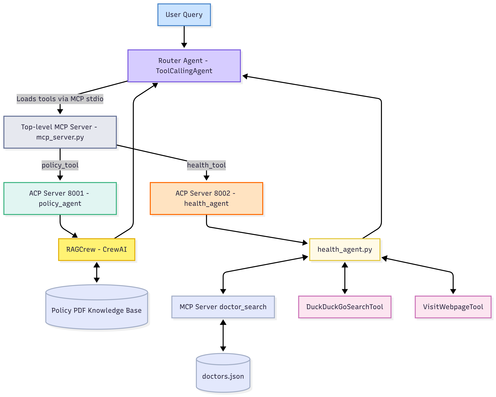

# Multi-Agent AI System - Healthcare & Insurance Assistant

This system implements a sophisticated multi-agent AI architecture designed to handle healthcare and insurance-related queries through a distributed system of specialized agents, servers, and tools.

## 🏗️ System Architecture

The system consists of multiple components working together:

### 📊 System Flow Diagram



### 🔄 Component Interaction Flow


## 🚀 Components Overview

### 1. Router Agent (`router_agent.py`)
- **Purpose**: Main entry point for user queries
- **Technology**: SmoLAgents with LiteLLM (Qwen 2.5:7b via Ollama)
- **Function**: Routes queries to appropriate specialized agents via MCP server
- **Port**: Runs as standalone script

### 2. MCP Server (`mcp_server.py`)
- **Purpose**: Tool orchestrator and request router
- **Technology**: FastMCP
- **Tools Provided**:
  - `policy_tool`: Routes to ACP Agent 1 for insurance policy queries
  - `health_tool`: Routes to ACP Agent 2 for health-related queries
- **Communication**: Uses ACP SDK to communicate with downstream agents

### 3. ACP Agent 1 - Policy Agent (`acp_agent_1/`)
- **Purpose**: Handles insurance policy coverage questions
- **Port**: 8001
- **Technology Stack**:
  - ACP SDK Server
  - CrewAI for orchestration
  - RAG (Retrieval-Augmented Generation) system
  - Chroma DB for vector storage
  - Google Gemini 2.5 Flash for LLM
- **Data Source**: `gold-hospital-and-premium-extras.pdf`

#### Sub-components:
- **RAG Crew** (`crews/rag_crew.py`): Orchestrates the RAG workflow
- **Insurance Agent** (`agents/crew_agents.py`): Specialized CrewAI agent for insurance queries
- **RAG Tool** (`tools/crew_tools.py`): Custom tool for document retrieval and processing

### 4. ACP Agent 2 - Health Agent (`acp_agent_2/`)
- **Purpose**: Handles general health and hospital treatment questions
- **Port**: 8002
- **Technology Stack**:
  - ACP SDK Server
  - SmoLAgents with multiple tools
  - Local MCP server for doctor database
  - Web search capabilities

#### Sub-components:
- **Health Agent** (`health_agent.py`): Main agent with web search and doctor lookup
- **Doctor MCP Server** (`mcp_server.py`): Provides doctor search functionality
- **Doctor Database** (`doctors.json`): Comprehensive doctor information database

## 🛠️ Technology Stack

- **Agent Frameworks**: 
  - SmoLAgents (Router and Health Agent)
  - CrewAI (Policy Agent orchestration)
- **Communication**: 
  - ACP SDK (Agent Communication Protocol)
  - MCP (Model Context Protocol)
- **LLM Models**:
  - Qwen 2.5:7b (via Ollama) for SmoLAgents
  - Google Gemini 2.5 Flash for CrewAI
- **Vector Database**: Chroma DB
- **Document Processing**: RAG with PDF support
- **Web Tools**: DuckDuckGo Search, Web Page Visitor

## Project Structure

```
Modularized System/
├── README.md                              # This documentation file
├── router_agent.py                        # Main entry point - Router Agent
├── mcp_server.py                          # Tool orchestrator using FastMCP
├── acp_agent_1/                           # Policy Agent (ACP Server - Port 8001)
│   ├── acp_server.py                      # ACP server entry point
│   ├── acp_client.py                      # ACP client for testing
│   ├── main.py                            # Standalone runner
│   ├── config.json                        # LLM and RAG configuration
│   ├── crewai-rag-tool.lock              # CrewAI dependencies lock file
│   │
│   ├── agents/                            # CrewAI Agent definitions
│   │   ├── crew_agents.py                 # Insurance coverage specialist agent
│   │
│   ├── crews/                             # CrewAI workflow orchestration
│   │   ├── rag_crew.py                    # RAG crew workflow definition
│   │
│   ├── tasks/                             # CrewAI Task definitions
│   │   ├── crew_tasks.py                  # Insurance query tasks
│   │
│   ├── tools/                             # Custom RAG tools
│   │   ├── crew_tools.py                  # RAG tool implementation
│   │
│   ├── data/                              # Document sources
│   │   └── gold-hospital-and-premium-extras.pdf  # Insurance policy document
│   │
│   └── db/                                # Vector database storage
│       ├── chroma.sqlite3                 # Chroma database file
│
└── acp_agent_2/                           # Health Agent (ACP Server - Port 8002)
    ├── acp_server.py                      # ACP server entry point
    ├── health_agent.py                    # Main health agent logic
    ├── mcp_server.py                      # Local MCP server for doctor tools
    ├── doctors.json                       # Doctor database
```

### 📂 Key File Descriptions

#### **Root Level Files**
- **`router_agent.py`**: SmoLAgents-based entry point that discovers MCP tools and routes queries
- **`mcp_server.py`**: FastMCP server exposing `policy_tool` and `health_tool` for agent communication
- **Diagram Files**: Visual representations of system architecture and interaction flows

#### **ACP Agent 1 - Policy Agent** (`acp_agent_1/`)
- **`acp_server.py`**: ACP server hosting the policy_agent endpoint
- **`config.json`**: Configuration for Google Gemini LLM and Ollama embeddings
- **`agents/crew_agents.py`**: CrewAI agent specialized for insurance coverage queries
- **`crews/rag_crew.py`**: Orchestrates RAG workflow using CrewAI framework
- **`tasks/crew_tasks.py`**: Defines specific insurance query tasks
- **`tools/crew_tools.py`**: Custom RAG tool for PDF document processing
- **`data/`**: Contains insurance policy PDF for RAG processing
- **`db/`**: Chroma vector database with embedded policy document content

#### **ACP Agent 2 - Health Agent** (`acp_agent_2/`)
- **`acp_server.py`**: ACP server hosting the health_agent endpoint  
- **`health_agent.py`**: SmoLAgents-based agent with web search and doctor lookup
- **`mcp_server.py`**: Local MCP server providing doctor search functionality
- **`doctors.json`**: Comprehensive database with 240+ doctor profiles across specialties

### 🔄 Data Flow Through Structure
1. **User Query** → `router_agent.py`
2. **Tool Discovery** → `mcp_server.py` (exposes policy_tool, health_tool)
3. **Policy Queries** → `acp_agent_1/acp_server.py` → CrewAI RAG workflow
4. **Health Queries** → `acp_agent_2/acp_server.py` → SmoLAgents + local MCP tools
5. **Response Aggregation** → Back through the protocol stack to user

## �📋 Prerequisites

1. **Ollama** with Qwen 2.5:7b model
2. **Google API Key** for Gemini 2.5 Flash
3. **Python 3.11+**
4. **UV package manager** (recommended)

## 🚀 Installation & Setup

1. **Install Dependencies**:
```bash
pip install -r requirements.txt
```

2. **Environment Configuration**:
Create a `.env` file in `acp_agent_1/` with:
```env
GOOGLE_API_KEY=your_google_api_key_here
```

3. **Start Ollama**:
```bash
ollama serve
ollama pull qwen2.5:7b
```

## 🏃‍♂️ Running the System

The system requires multiple components to be running simultaneously. Start them in this order:

### Terminal 1: ACP Agent 1 (Policy Agent)
```bash
cd "acp_agent_1"
python acp_server.py
```

### Terminal 2: MCP Server for ACP Agent 2 (Health Agent)
```bash
cd "acp_agent_2"
python mcp_server.py
```

### Terminal 3: ACP Agent 2 (Health Agent)
```bash
cd "acp_agent_2"
python acp_server.py
```

### Terminal 4: MCP Server (Tool Orchestrator)
```bash
python mcp_server.py
```

### Terminal 5: Router Agent (Main Interface)
```bash
python router_agent.py
```

## 💡 Usage Examples

### Policy Coverage Queries
- "What is the waiting period for rehabilitation services?"
- "Is dental care covered under the premium plan?"
- "What are the coverage limits for emergency room visits?"

### Health & Treatment Queries
- "What are the symptoms of diabetes?"
- "Find me cardiologists in Georgia"
- "What treatments are available for high blood pressure?"

## 🔧 Configuration

### ACP Agent 1 Configuration (`acp_agent_1/config.json`)
```json
{
    "llm": {
        "provider": "google",
        "config": {
            "model": "gemini-2.5-flash",
            "api_key": "${GOOGLE_API_KEY}",
            "temperature": 0.5,
            "max_tokens": 4096
        }
    },
    "rag_tool_config": {
        "llm": {
            "provider": "google",
            "config": {
                "model": "gemini-2.5-flash",
                "api_key": "${GOOGLE_API_KEY}"
            }
        },
        "embedding_model": {
            "provider": "ollama",
            "config": {
                "model": "all-minilm:latest"
            }
        }
    }
}
```

## 🗄️ Data Sources

### Insurance Policy Documents
- **Location**: `acp_agent_1/data/gold-hospital-and-premium-extras.pdf`
- **Purpose**: Source material for RAG system to answer policy coverage questions

### Doctor Database
- **Location**: `acp_agent_2/doctors.json`
- **Content**: Comprehensive database with many doctors across various specialties
- **Fields**: Name, specialty, address, contact info, education, affiliations, insurance accepted

## 🏗️ System Features

### � **MCP-Powered Tool Orchestration**
- **Tool Discovery**: MCP server dynamically exposes `policy_tool` and `health_tool` to the router agent
- **Protocol Standardization**: Uses MCP's standardized tool interface for seamless integration
- **Tool Composition**: Router agent automatically discovers and composes available MCP tools
- **Cross-Agent Communication**: MCP enables tools to communicate with remote ACP agents seamlessly

### 🤖 **ACP-Based Agent Communication**
- **Agent Discovery**: ACP servers expose specialized agents (`policy_agent`, `health_agent`) on dedicated endpoints
- **Async Message Passing**: Non-blocking communication between agents using ACP's async message protocol
- **Distributed Agent Network**: Multiple ACP servers run independently while maintaining communication
- **Standardized Agent Interface**: All agents follow ACP's Message/MessagePart structure for consistency

### � **Protocol Integration Patterns**
- **MCP-to-ACP Bridge**: MCP tools seamlessly invoke ACP agents using the ACP SDK client
- **Tool-Agent Mapping**: Each MCP tool corresponds to a specific ACP agent endpoint
- **Protocol Translation**: Automatic conversion between MCP tool calls and ACP agent messages

### 🔧 **Protocol-Driven Modular Architecture**
- **ACP Agent Isolation**: Each specialized agent runs in its own ACP server instance
- **MCP Tool Registry**: Central MCP server acts as tool registry and orchestrator
- **Loose Coupling**: Components communicate only through standardized protocols
- **Independent Scaling**: ACP agents can be scaled independently based on demand

### 🔀 **Cross-Protocol Data Flow**
- **User Query → Router Agent**: Direct interaction with SmoLAgents
- **Router → MCP Server**: Tool discovery and execution via MCP protocol
- **MCP Tools → ACP Agents**: Remote agent invocation using ACP SDK
- **ACP Agents → Specialized Tools**: Internal tool orchestration (CrewAI, SmoLAgents, etc.)
- **Response Aggregation**: Results flow back through the protocol stack to the user

## 🔮 Future Enhancements

1. **Multi-Language Support**: Extend to support multiple languages
2. **Advanced Analytics**: Add usage analytics and performance monitoring
3. **Real-time Updates**: Dynamic updating of doctor database and policy documents
4. **Voice Interface**: Add voice input/output capabilities
5. **Mobile Integration**: Develop mobile app interface

## 🤝 Contributing

This system demonstrates advanced multi-agent AI architecture patterns and can be extended for various domain-specific applications.

## 📄 License

This project is part of the ACP (Agent Communication Protocol) learning resources.

---

*This multi-agent system showcases the power of distributed AI architectures, combining specialized agents, advanced communication protocols, and modern AI tools to create a comprehensive healthcare and insurance assistant.*